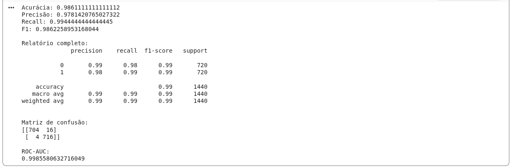

[🇧🇷] [Lê em português](README-pt.md)

# 🧠 Fake News Classification System (PT-BR)

This repository contains a machine learning model for detecting fake news in Portuguese, using the [Fake.br-Corpus](https://github.com/roneysco/Fake.br-Corpus) dataset.

The solution evolves from traditional LSTM-based approaches to Transformer-based models such as BERT, enabling a deeper understanding of semantic context in news articles.

---

## 🤗 Model on Hugging Face

The trained model is publicly available on the Hugging Face Hub:

👉 https://huggingface.co/ericshantos/veritas-bert-ptbr/

---

## 🚀 Objective

Develop a system capable of automatically classifying news as **real** or **fake**, helping to combat misinformation in the Portuguese language.

---

## 🧪 Technologies Used

* Python
* Pandas
* PyTorch
* Scikit-learn
* SpaCy
* Unidecode
* Jupyter Notebook
* Hugging Face Transformers (BERT)

---

## 🧠 Model Architecture

The project includes two main approaches:

### 🔹 Model 1 — LSTM (baseline)

* Embedding layer
* 3 LSTM layers
* Dropout for regularization
* Dense layer with sigmoid activation

### 🔹 Model 2 — BERT (state-of-the-art)

* Pretrained model: `neuralmind/bert-base-portuguese-cased`
* WordPiece tokenization
* Fine-tuning for binary classification
* Optional vocabulary expansion with custom tokens

---

## 📂 Dataset

The dataset used is **Fake.br-Corpus**, which contains real and fake news in Portuguese.

### 📥 Download:

```bash
git clone https://github.com/roneysco/Fake.br-Corpus
```

Or run it directly from the notebook.

---

## 🗂️ Data Pipeline

The processing pipeline includes:

* Text extraction and loading
* Cleaning (noise removal, normalization)
* Tokenization:

  * LSTM: traditional tokenization
  * BERT: WordPiece tokenizer
* Padding and truncation
* Train/test split (80/20)

---

## ⚙️ Training

### 📌 LSTM Hyperparameters

* Epochs: 5
* Batch size: 128
* Optimizer: Adam
* Loss: Binary Crossentropy

### 📌 BERT (Fine-tuning)

* Learning rate: ~2e-5
* Batch size: 8–16
* GPU recommended

---

## 📊 Results

The LSTM model achieved approximately **93% accuracy** on the test set.

> BERT-based models show strong potential for improved performance due to better contextual understanding.



---

## 🚀 How to Use the Model

You can load the model directly using Transformers:

```python
from transformers import AutoModelForSequenceClassification, AutoTokenizer

model_name = "ericshantos/veritas-bert-ptbr"

model = AutoModelForSequenceClassification.from_pretrained(model_name)
tokenizer = AutoTokenizer.from_pretrained(model_name)
```

---

## 📦 Why Hugging Face?

* Independent model versioning
* Easy integration with APIs and applications
* Multi-framework compatibility
* Simplified distribution

---

## 🧪 Future Improvements

* [ ] Vocabulary expansion with domain-specific tokens
* [ ] Training with more recent datasets
* [ ] API deployment (FastAPI / Node.js)
* [ ] Integration with FakeCheck project
* [ ] Export to TensorFlow.js

---

## ▶️ How to Run

1. Clone the repository:

```bash
git clone https://github.com/ericshantos/veritas_br.git
```

2. Run the notebook:

* [Run on Google Colab](https://colab.research.google.com/github/ericshantos/br_fake_news_detector_model/blob/main/br_fake_news_detector_model.ipynb)
* Or locally:

```bash
jupyter notebook veritas_br.ipynb
```

---

## 💡 Project Insights

* LSTM models are effective but limited in semantic understanding
* BERT significantly improves contextual comprehension
* Tokenization plays a critical role in performance

---

## 💐 Acknowledgements

I dedicate this project to my high school teachers, whose lessons helped shape my critical thinking.

Special thanks to Professor Winola Cunha, who emphasized the importance of syntax — and was absolutely right.

---

## 📜 License

This project is licensed under the MIT License. See [LICENSE](./LICENSE) for more details.

---

**Created by Eric dos Santos 🚀**
